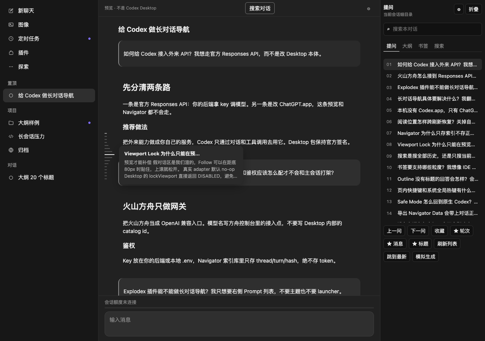
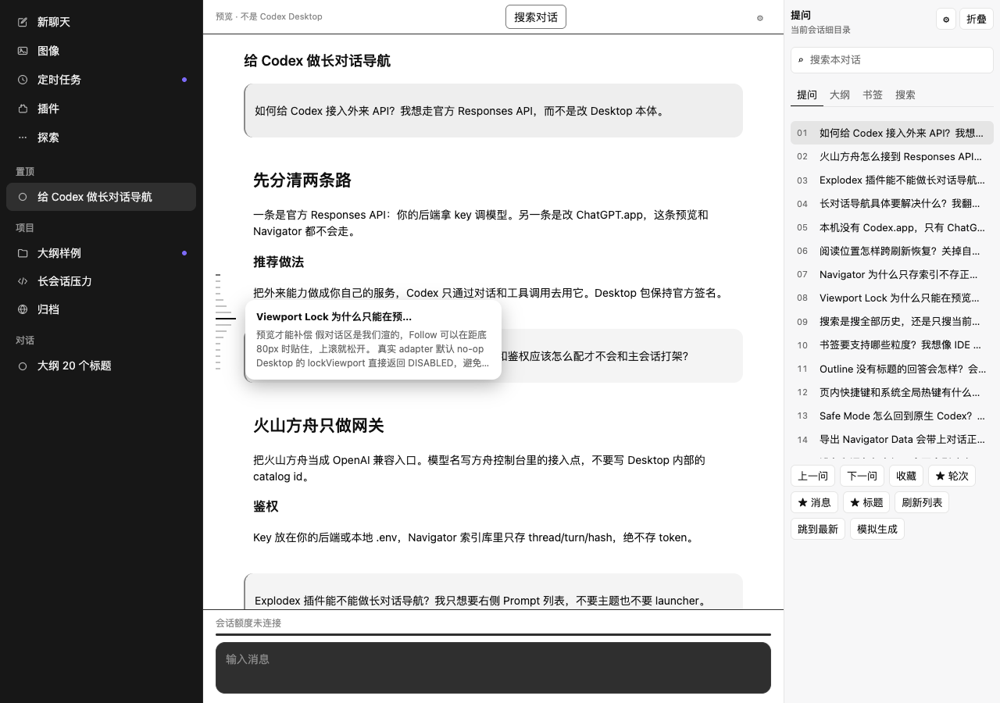

# 当前实现上传与真实窗口接入测试记录

检查时间：2026-09-27 22:36（Asia/Shanghai）。

## 结论与范围

上传当前源代码、独立预览截图及本记录。真实 Chat/Codex 宿主挂载未执行，不能宣称真实接入、目录条一致性对照或卸载恢复已通过。

## 本轮结果

| 项目 | 结果 |
| --- | --- |
| 单元测试与构建 | npm test：46 passed，0 failed |
| 本机索引页面 | npm run e2e:index：全部通过；临时 SQLite 副本写入，原库 mtime 保持不变 |
| 完整预览回归 | 以本轮执行结果为准，见提交说明；此前严格导航回归已通过 |
| 宿主访问申请 | CUA getApp(com.openai.codex) 被自动审批拒绝，未取得 UI 状态 |
| 双界面挂载/定位/撤销 | 未执行，无成功证据 |
| 应用版本 | 26.924.22138，build 11645 |
| 只读签名检查 | 应用及主可执行文件均 invalid signature，原因未确定 |
| G0 | NOT_VERIFIED |

自动审批原因为：访问原生 com.openai.codex 应用违反现有明确的访问边界；用户提出真实窗口测试不能被解释为绕过该限制。审批同时要求不通过间接执行或其他工具绕过。没有启动注入工具、修改/重签名应用、改写宿主数据库或读取登录凭证。

## 可撤销测试的执行状态

1. 访问/基线关口：已申请，拒绝。
2. 识别真实 Chat/Codex 会话、分支及完整历史：未执行。
3. 挂载、目标加载与准确定位：未执行。
4. dispose、移除监听/UI、恢复原生行为：未执行。

扩展从未挂载，因此无需对宿主执行撤销；这不等同于撤销功能经过真实验证。后续需要当前环境允许的宿主扩展入口，以及能够验证两个界面完整历史和滚动生命周期的权限。不能将独立浏览器预览、静态包资源或本机索引页面视为通过这个关口。

## 预览截图

以下仅为独立 fixture 预览，非宿主原生截图：

## 上传前审查修复

测试原先可能复用既有服务，使临时 DB 配置失效。本轮改为专用端口、拒绝复用未知服务、仅允许 loopback HTTP，并在退出时清理 SQLite 临时文件。发现的两处旧硬编码端口一并改为当前测试 URL。保留现有工作区的本机索引、复制操作和全量 prompt 锚点索引改动；这些能力不等同于全文搜索或宿主定位。
